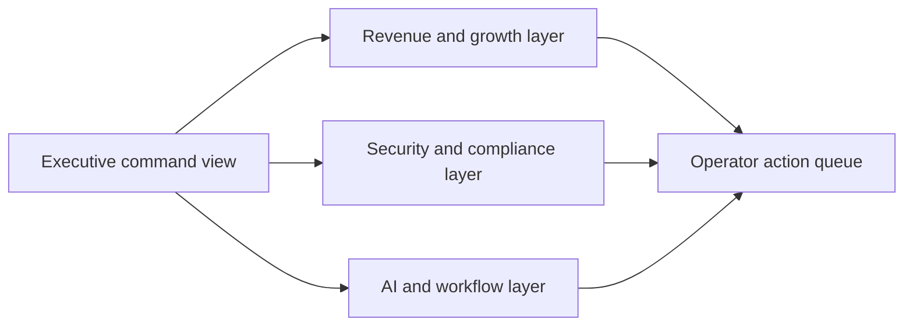

# Growth Systems Control Room

React + TypeScript flagship frontend that ties revenue operations, experimentation, security governance, AI oversight, and workflow execution into one coherent command surface.

## Executive Summary

This project is designed as a portfolio centerpiece. Instead of showing one more isolated internal tool, Growth Systems Control Room treats the broader portfolio as a coordinated operating model. It gives leadership and operators a shared view of commercial pressure, growth signals, security posture, AI workflow health, and cross-domain action sequencing.

## Recruiter Takeaway

This repo demonstrates product judgment, systems thinking, visual hierarchy, and cross-functional operational design. It is meant to feel like a true flagship.

## Tech Stack

[](https://react.dev/)
[](https://vite.dev/)
[](https://www.typescriptlang.org/)
[](https://developer.mozilla.org/en-US/docs/Web/CSS)
[](https://vitest.dev/)
[](https://opensource.org/license/mit)

## Overview

| Area | What it covers |
| --- | --- |
| Executive summary | Revenue, growth, security, and AI signals in one opening surface |
| Domain map | Revenue Ops, Growth, Security, and AI laid out as one operating system |
| Signal wall | Score-driven leadership risk view |
| Action queue | Cross-domain interventions needing coordinated execution |
| Scenario board | Different strategic steering modes for the system |
| Architecture | High-level control-plane framing for the rest of the portfolio |

## Why This Exists

Most internal systems stay fragmented:

- one place for revenue reporting
- another for experimentation
- another for identity or vendor governance
- another for AI workflow review

This project collapses that fragmentation into a single operator-facing surface so the portfolio reads like one connected business system, not just a list of repos.

## Architecture / Workflow



## Screenshots

### Hero Capture


### Domain Map


### Signal Wall


### Scenario and Queue


## Local Run

```powershell
Set-Location "C:\Users\chaus\dev\repos\growth-systems-control-room"
npm install
npm test
npm run build
npm run dev
```

## Portfolio Links

- [Kinetic Gain](https://kineticgain.com/)
- [Skills / Portfolio](https://mizcausevic.com/skills/)
- [LinkedIn](https://www.linkedin.com/in/mirzacausevic)
- [Medium](https://medium.com/@mizcausevic)
- [GitHub](https://github.com/mizcausevic-dev)
