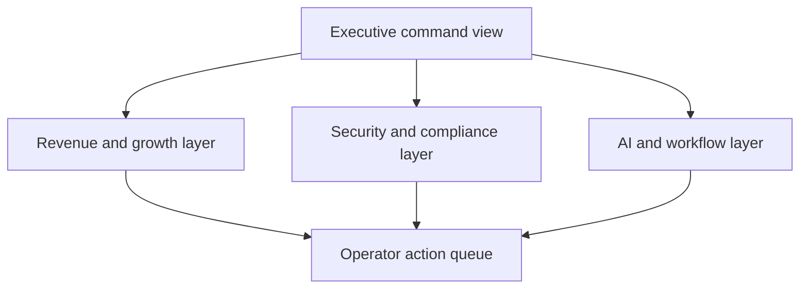

# Growth Systems Control Room Architecture

## Product Intent

Growth Systems Control Room is meant to act like a flagship command surface across the portfolio. It makes separate systems feel coordinated:

- revenue operations
- experimentation and attribution
- security and compliance
- AI operations and workflow governance

## Workflow View

## Interface Blocks

- **Hero layer**: frames the system and summarizes pressure.
- **Domain map**: lays out the major operating layers.
- **Signal wall**: prioritizes what leadership should worry about first.
- **Action queue**: turns signals into execution.
- **Scenario board**: makes strategic steering visible.
- **Architecture stack**: explains how the rest of the portfolio ties together.
